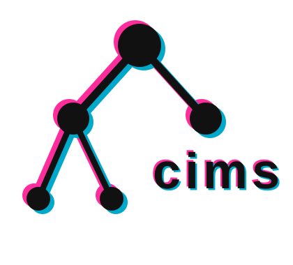

<picture>
  <source media="(prefers-color-scheme: dark)" srcset="docs/images/cims_logo_dark.svg">
  
</picture>

# CIMS
CIMS is a Python package providing the implementation of the [CIMS](https://emrg-sfu.github.io/cims/)
energy-emissions-economy model. 

## :gear: Installation
CIMS is not currently available on PyPi or other package indexes. Follow the [setup instructions](https://emrg-sfu.github.io/cims/setup.html) to get CIMS running on your machine.

## :technologist: Usage
See the [getting started guide](https://emrg-sfu.github.io/cims/getting_started.html) for instructions on running CIMS scenarios.

## :memo: Contributing
Contributions to CIMS are welcome, in many different forms: 
* **Issues** &mdash; If you identify a bug, error in the documentation, or a potential improvement to CIMS, consider putting this information into an issue. First, search the list of [existing issues](https://github.com/EMRG-SFU/cims/issues) to see if there is an ongoing discussion to join. If a relevant issue doesn't already exist, please [create a new issue](https://github.com/EMRG-SFU/cims/issues/new).
* **Code** &mdash; If you are comfortable writing code feel free to make a Pull Request (PR) with your changes. If you've tackled a large feature request or bug, please also create a new issue, or mention an existing issue within your PR.
* **Documentation** &mdash; If you notice typos, out-of-date information, or opportunities for improvements in the documentation (and are comfortable writing [Markdown](https://docs.github.com/en/get-started/writing-on-github/getting-started-with-writing-and-formatting-on-github/basic-writing-and-formatting-syntax)), please consider making a PR with changes.

Any kind of contribution, whether it involves fixing a small typo, refactoring existing code, or implementing a brand new module, helps improve this project.

## :pray: Acknowledgements
[Brad Griffin](https://github.com/brad-griffin) and [Jillian Anderson](https://github.com/jillianderson8) are the Python project's lead researcher and lead technical developer, respectively. [Matt Sniatynski](https://github.com/matt-exmath) has provided invaluable expertise as the lead data scientist.

In addition, contributions to the codebase have been made by members of Simon Fraser University's [Big Data Hub](https://www.sfu.ca/big-data.html) and [Research Computing Group](https://www.rcg.sfu.ca/): 
* [Steven Bergner](https://github.com/git-steb)
* [Rashid Barket](https://github.com/rbarket)
* [Maude Lachaine](https://github.com/semaphore-maude)
* [Adriena Wong](https://github.com/atwong88)
* Daisy Yu
* Kacy Wu

The Python implementation of the CIMS model has been significantly supported by development from staff at the Canadian Energy Regulator's [Energy Future](https://www.cer-rec.gc.ca/en/data-analysis/canada-energy-future/) team and the University of Victoria's [SESIT Group](https://sesit.cive.uvic.ca/#team).

Thank you to the numerous EMRG graduate students who have attended meetings, submitted feature requests, and flagged bugs: 
* Kaitlin Thompson
* Saaib Choudhry
* Aaron Hoyle
* Roz Shepherd
* Katrina Gorrie

In particular, [Thomas Budd](https://github.com/tcbudd) and Emma Starke contributed many hours of effort helping to realise this project.

Finally, the original development of the CIMS model methodology and APL/Java implementation occurred over many years and had many contributors. Principle contributors included Dr. Mark Jaccard, Dr. John Nyboer, Dr. Chris Bataille, Jotham Peters, Nic Rivers, JianJun Tu, Rose Murphy, Bryn Sadownik, Alison Laurin, and William Tubbs. Many other members of Simon Fraser University's [EMRG Group](https://www.sfu.ca/emrg.html) provided invaluable time and effort.

## :balance_scale: License
The CIMS Python library is licensed under the [MIT License](https://github.com/EMRG-SFU/cims/blob/main/LICENSE). For more information about this license, checkout [this overview](https://choosealicense.com/licenses/mit/).

## :book: Citation
If you use this project, please cite:

Griffin, B., Anderson, J., & Sniatynski, M. (2025). *CIMS energy-emissions-economy model* (Version 1.0) [Software]. https://github.com/EMRG-SFU/cims