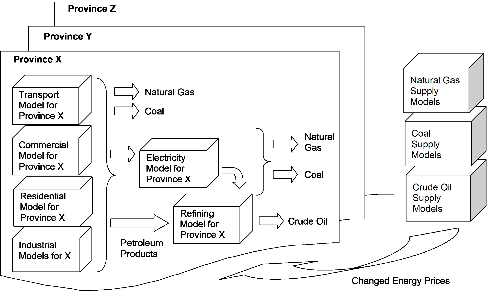

# Energy Supply and Demand

## Energy Pricing

### Primary Energy

#### Fixed Price

#### Cost Curve -- Annual

#### Cost Curve -- Cumulative

### Secondary Energy

### Carbon pricing

<mark>TODO: Add section on biomass supply modelling</mark>

In CIMS's integrated energy supply and demand system, the demands of final demand sectors directly drive the activities of electricity production, refining, coal mining and natural gas and crude oil extraction. Inter-regional transfers as well as net exports are added, as demand for Canada's energy supply sector includes US demand. The importance of domestic demand varies by energy commodity. Most electricity is produced for Canadian consumers, more than half of natural gas produced is shipped to the US, and there is a heavy trade in crude oil and refined petroleum products. Half our domestic crude oil production is shipped to the US, while we import from both OPEC and non-OPEC suppliers.

<mark>**Need to revise this description to reflect the current setup, but should preserve a more complete version as a comment for later upgrades.
Adjust the descriptions below to detail the fully endogenous options and note that many can be switched to exogenous function.**</mark>

Each of the energy markets in CIMS has the option of fixed or dynamic pricing, and they are described below:

- Regional electricity markets are included with endogenous internal pricing based on the cost of production. The amount of electricity produced is the sum of endogenous domestic demand and net extra-regional exports, which may be adjusted using an export own-price elasticity.

- One national natural gas market is included, with dynamic pricing using a supply curve based on a combination of Canadian and US market feedbacks. The amount of gas produced is the sum of endogenous domestic demand and net exports. Net exports may be adjusted to reflect changes in the domestic cost of production using an export price elasticity.

- One national crude oil market, based on an exogenously specified world price of crude oil. The amount of crude oil produced is the sum of endogenous domestic demand and net exports. Net exports may be adjusted to reflect changes in the domestic cost of production using an export elasticity. The world crude oil price is assumed to be unresponsive to Canadian demand.

- Petroleum refining regions divide their production amongst demand regions and net exports. All can use endogenous internal pricing based on the cost of production. The amount of refined petroleum products produced is the sum of domestic regional demand and net extra-regional exports.

- Coal producing regions divide their thermal coal production amongst endogenous domestic regional demand and exogenous exports (i.e. BC exports 100% of its production while Alberta exports about 30% of its production). Due to the differences between the ways each non-producing region and sector gets its coal, these regions are assumed to buy coal at a fixed market price or according to a local supply curve -- for example, some electricity plants in Alberta and Saskatchewan are sited at coalfields and are the sole customers. British Columbia, Alberta, Saskatchewan and the Atlantic provinces all buy their coal at a fixed market price.

- **-\> Revise coal description to separate thermal coal (exogenous) and metallurgical (endogenous).**

CIMS divides energy flow in the economy into demand for energy end-use services, intermediate processing, and primary supply (@fig-final_intermediate_primary_flow). It begins with an initial demand for four general end-use energy commodities: electricity, natural gas, coal, and refined petroleum products. The electricity needs of the domestic energy demand models (transportation, residential, commercial and industry) plus net electricity transfers (inter-regional transfers and exports) are used to drive electricity generation. The refined petroleum products sector is driven by the net demand from the energy demand models, electricity, inter-regional transfers, and net exports. The primary energy supply models, crude extraction, coal mining and natural gas extraction and transmission are driven by the net demand for their products from the final demand sectors, electricity and refined petroleum.

{#fig-final_intermediate_primary_flow .lightbox}

The electricity demands of petroleum refining, the refined petroleum product demands of the primary energy supply models, and the interdependencies among the primary energy supply models create feedback loops within the system. Because CIMS operates as a simulation model rather than a computable general equilibrium model, these feedback loops cannot be resolved within a single iteration of the demand–supply algorithm. To address this limitation, CIMS is run iteratively until lifecycle costs throughout the model converge below a specified threshold criterion (typically less than a 5% difference between iterations). Additional iterations may also be performed to ensure that the effects of the feedback loops have stabilized.

Canada trades a significant amount of energy with the United States and, to a lesser extent, with both OPEC and non-OPEC suppliers. Given the possible effect of Canadian energy policy on the price of producing these commodities, and hence their marketability to the US, electricity, crude oil and natural gas export feedbacks are included in CIMS using price elasticities calculated for the Canadian Federal Department of Finance (@tbl-export_price_elas).

<mark>**change this table to GTAP? talk to Thomas**</mark>

| Energy Commodity | Long-Run Own-price Elasticity for Export Demand |
|:----|:----:|
| Electricity | -0.54 |
| Natural gas | -0.67 |
| Coal | -0.51 |
| Gasoline and fuel oil | -0.92 |
| Other petroleum products | -0.82 |

: Price Elasticities for Energy Exports, Wirjanto (1999) {#tbl-export_price_elas}

These elasticities follow the Armington specification, whereby the demand for an imported good rises as its price falls relative to the price of its domestic substitute. At all times, consumers buy at least some of the domestic good and some of the imported good, even when the price difference is large (Iorwerth et al. 2000, Wirjanto 1999). See Bataille (2005) for further elaboration. The Armington specification assumes that goods produced by different countries are not perfect substitutes. The energy trade elasticities are represented in @eq-armington_energy, which applies the elasticity of the ratio of import volumes to domestic production in relation to a change in the relative price of imports to domestic prices.

$$
\text{(Equation 25 — placeholder for the energy trade Armington elasticity)}
$$ {#eq-armington_energy}

::: {.eq-vars}
$FLCC_t$
:   current financial lifecycle cost for producing the energy commodity

$FLCC_{t-1}$
:   previous financial lifecycle cost for producing the energy commodity

$COP$
:   cost of production covered by the energy-producing sub-model, as a percentage of total cost

$\sigma$
:   price demand elasticity for the energy commodity

$IT$
:   initial trade volume of the energy commodity

$Adj_{prod}$
:   additive adjustment to production of the energy commodity
:::

Western Canadian exports of crude oil are separated from eastern Canadian imports, as there are currently no large cross-country shipments. While electricity trade is currently a very small portion of our energy trade, electricity import substitution elasticities are included to cover the possibility of a policy driven increase or decrease in electricity exports to the US.
