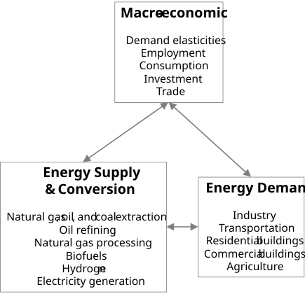
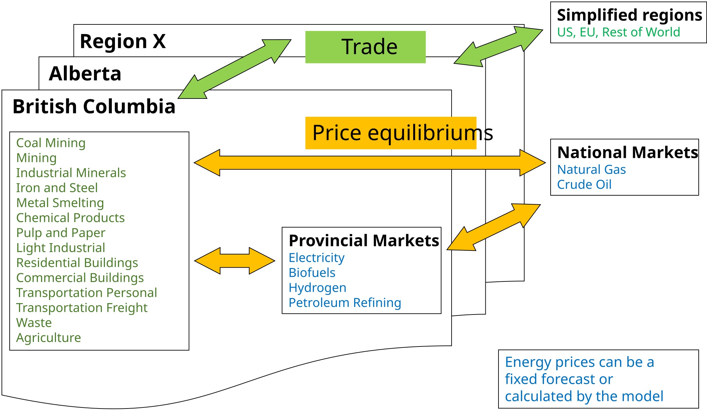

# Introduction to CIMS

## Background and model objectives

CIMS[^overview-1] is an integrated set of economic, energy, and materials models designed to provide information to decision makers on the likely response of firms and households to policies that influence their technology acquisition and use decisions. Technology is widely defined to include not just equipment but also buildings and major infrastructure such as transit networks. Thus, it is sometimes described as a technology simulation model, which seeks to reflect how people actually behave rather than how they ought to behave. CIMS is able to provide policy makers with information on: (1) the ability of their policies to achieve specific objectives (like greenhouse gas (GHG) emissions reductions), (2) the likely costs of achieving these objectives, and (3) the uncertainties associated with the model's simulations. CIMS is maintained and operated by the Energy and Materials Research Group at the School of Resource and Environmental Management at Simon Fraser University.

[^overview-1]: CIMS originally stood for Canadian Integrated Modelling System. The acronym is now used as a proper name, since over its history the model has been applied to several other countries and regions.

CIMS is based on energy flows through a country's economic system. Like its predecessor, the ISTUM family of models, which form the individual sub-components of CIMS, it tracks the flow of energy, beginning with energy services and production processes through to eventual end-use by individual technologies. Unlike the partial equilibrium ISTUM models, which compete technologies against each other to serve pre-specified demands for end-uses, CIMS is nearly a full equilibrium system that allows the practitioner to include price driven energy and goods and services supply and demand equilibrium, energy trade, and some indirect macroeconomic effects, specifically disposable income and savings multiplier effects.

The model's focus on energy flows through technologies makes it ideal for modelling policies intended to affect energy efficiency, greenhouse gas emissions, and air quality. Fuel consumption and emissions of all pollutants are technology specific; unless a model operates on a detailed technology basis, as CIMS does, fuel consumption and emission estimates can only be approximated by economic activity.

## Model Scale and Scope

CIMS covers the entire Canadian economy and can connect to aggregated representations of other regions (e.g., United States, Europe, or Rest of World). @tbl-sectors-regions-dynamic illustrates the sectors and regions currently covered in CIMS.[^overview-2]

[^overview-2]: Canadian territories are not currently represented in CIMS.

```{python}
#| label: tbl-sectors-regions-dynamic
#| tbl-cap: "Sectors represented by Canadian region"
#| echo: false
# Dynamically build the sector x region table from the contents of
# data/model_inputs/. A sector is marked "X" for a region when at least one
# row in any model_inputs CSV has Parameter == "service_provide" and the
# Branch column starts with that region's branch path from
# data/mappings_conversions/region_primary.csv. Row ordering follows the
# `cims` column of data/mappings_conversions/sector_map.csv.
#
# When the model is run with a region aggregation
# (data/mappings_conversions/region_aggregation_*.csv) and that aggregation
# is present in the model inputs, the aggregation replaces its child
# regions as a single column. Any region with no sectors is dropped from
# the table.

import pandas as pd
from pathlib import Path
from IPython.display import Markdown

# Walk up from the current working directory until we find the project's
# data folder, so this works whether Quarto is rendering a chapter or the
# whole book.
root = Path.cwd()
while not (root / "data" / "mappings_conversions").exists():
    if root.parent == root:
        raise FileNotFoundError(
            "Could not find project root containing data/mappings_conversions"
        )
    root = root.parent

mc_dir = root / "data" / "mappings_conversions"
regions_df = pd.read_csv(mc_dir / "region_primary.csv")
sectors_df = pd.read_csv(mc_dir / "sector_map.csv")

# Primary regions: list of (lowercase branch, uppercase code) preserving
# the order from region_primary.csv. This drives the default column order.
primary = [
    (str(b).strip().lower(), str(c).upper())
    for b, c in zip(regions_df["branch"], regions_df["code"])
]
primary_codes_order = [c for _, c in primary]

# Load each aggregation file. Each file maps a single aggregation code to
# the child region codes it covers. The aggregation's own branch is
# {child_parent}.{agg_code} -- i.e. a sibling of its children -- which
# matches how aggregations like AT live at CIMS.CAN.AT, alongside
# CIMS.CAN.BC, CIMS.CAN.AB, etc.
aggregations = {}  # agg_code (upper) -> {"branch", "children", "name"}
primary_branch_by_code = {c: b for b, c in primary}
for agg_file in sorted(mc_dir.glob("region_aggregation_*.csv")):
    agg_df = pd.read_csv(agg_file, encoding="utf-8-sig")
    if agg_df.empty:
        continue
    agg_code = str(agg_df["code"].iloc[0]).strip().upper()
    agg_name = str(agg_df["name"].iloc[0]).strip()
    children = [str(x).strip().upper() for x in agg_df["region_primary"]]
    # Derive the parent prefix from any child branch we recognise.
    sample_child_branch = next(
        (primary_branch_by_code[c] for c in children if c in primary_branch_by_code),
        None,
    )
    if sample_child_branch is None:
        continue
    parent = sample_child_branch.rsplit(".", 1)[0]
    agg_branch = f"{parent}.{agg_code.lower()}"
    aggregations[agg_code] = {
        "branch": agg_branch,
        "children": children,
        "name": agg_name,
    }

# Lookup of full region names for the aggregation footnote text.
region_name_by_code = {
    str(c).strip().upper(): str(n).strip()
    for c, n in zip(regions_df["code"], regions_df["name"])
}

# Combined list of (branch, code) candidates -- primary regions and
# aggregations together -- sorted longest first so the most specific
# prefix wins when a Branch could match more than one.
candidates = list(primary) + [(info["branch"], code) for code, info in aggregations.items()]
candidates.sort(key=lambda x: -len(x[0]))

# Scan every CSV under data/model_inputs/ and collect (code, sector) pairs.
found = set()
for f in (root / "data" / "model_inputs").rglob("*.csv"):
    try:
        # The first line of each model input CSV is a "navigate by typing"
        # banner, so the real header is on row 2.
        df = pd.read_csv(f, skiprows=1, dtype=str, low_memory=False)
    except Exception:
        continue
    if not {"Branch", "Parameter", "Sector"}.issubset(df.columns):
        continue
    df = df.dropna(subset=["Branch", "Parameter", "Sector"])
    df = df[df["Parameter"].astype(str).str.strip() == "service_provide"]
    if df.empty:
        continue
    for branch, sector in zip(
        df["Branch"].astype(str).str.strip().str.lower(),
        df["Sector"].astype(str).str.strip(),
    ):
        for cand_branch, code in candidates:
            if branch == cand_branch or branch.startswith(cand_branch + "."):
                found.add((code, sector))
                break

# An aggregation is "active" if it produced at least one (code, sector)
# pair. Active aggregations replace their children in the column list.
codes_with_data = {c for c, _ in found}
active_aggs = [code for code in aggregations if code in codes_with_data]

column_order = list(primary_codes_order)
for agg_code in active_aggs:
    children = aggregations[agg_code]["children"]
    # Find the earliest position currently held by any child so the
    # aggregation column slots in roughly where the children were.
    insert_at = min(
        (column_order.index(ch) for ch in children if ch in column_order),
        default=len(column_order),
    )
    column_order = [c for c in column_order if c not in children]
    insert_at = min(insert_at, len(column_order))
    column_order.insert(insert_at, agg_code)

# Drop columns that ended up with no sectors at all.
column_order = [c for c in column_order if c in codes_with_data]

sector_order = [str(s).strip() for s in sectors_df["cims"]]

# Build the markdown table as one string and return it as a Markdown
# object. With the chunk's `label: tbl-...` and `tbl-cap: ...` directives,
# Quarto handles the caption and makes the table reachable via the
# cross-reference `@tbl-sectors-regions-dynamic`. Aggregation columns get
# an inline Pandoc footnote (`^[...]`) listing their child regions.
active_aggs_set = set(active_aggs)


def _format_header(code):
    if code not in active_aggs_set:
        return f"**{code}**"
    agg = aggregations[code]
    child_names = [region_name_by_code.get(ch, ch) for ch in agg["children"]]
    if len(child_names) > 1:
        child_list = ", ".join(child_names[:-1]) + ", and " + child_names[-1]
    else:
        child_list = child_names[0] if child_names else ""
    return f"**{code}**^[{agg['name']} includes {child_list}.]"


lines = [
    "| **Sectors** | " + " | ".join(_format_header(c) for c in column_order) + " |",
    "|:------------|" + "|".join([":----:" for _ in column_order]) + "|",
]
for sector in sector_order:
    # An empty bracketed span carrying the .cell-on class lets the
    # accompanying CSS (`td:has(.cell-on) { ... }` in style.css) shade
    # the entire cell instead of rendering a symbol inside it.
    cells = ["[]{.cell-on}" if (code, sector) in found else "" for code in column_order]
    lines.append("| " + sector + " | " + " | ".join(cells) + " |")

Markdown("\n".join(lines))
```


<mark>TODO: Could include major metro regions like Toronto, Montreal, and Vancouver to represent city building and transportation policies.</mark>

While the model is simple in operation, it can appear complex because it is technologically explicit and covers the whole economy. CIMS represents a detailed list of technologies (fridges, light bulbs, cars, industrial motors, steel furnaces, buildings, power plants, etc.), and includes their linkages to each other. The model is especially large for the industrial sectors because industry has the largest variety of technologies.

CIMS highlights the interplay of energy supply and demand because energy-related GHG emissions are currently a key policy concern. Thus, the model focuses on the interaction between sectors that use energy (industrial, residential, commercial / institutional, and transportation sectors) and sectors that produce or transform energy (electricity generation, fossil fuel supply, oil refining, natural gas processing, biofuels, and hydrogen). This interaction is shown in @fig-general_model_structure. A policy that seeks to influence energy supply and demand may also influence the cost of producing goods and services, thus affecting their price and final demand. To reflect these interactions, CIMS includes a goods and services final demand feedback loop, composed of Armington elasticities for traded goods and empirically driven relationships between the traded and non-traded sectors.

{#fig-general_model_structure .lightbox}

## Model Simulation: Six Steps

As a simulation model, CIMS simulates the evolution of technologies acquired to meet energy services, and it uses both engineering and economic information. The engineering information details the unit energy consumption of each energy service technology and explains, using flow models of technologically heterogeneous sectors, how final energy service demands, intermediate products, and energy supply are related. The economic information determines which technologies are preferable in terms of cost minimization. While CIMS is not an optimization model, it can be adapted to produce results like those of an optimization model by calling on certain built-in functions. These functions are known as winner-take-all functions, and they give all new market shares in a given competition to the technology or process with the least cost.

CIMS is designed to mimic a sector or industry by representing a number of industrial establishments, residential or commercial buildings, and delivery of goods or personal travel within a defined region. The model focuses its analysis on the aggregate energy end-use requirements of that industry or sector. For example, in industry the major end-uses are process heat, motive force, space heat, and lighting. In the pulp and paper sector, the major end-uses are steam heat or mechanical energy to digest wood fibre into pulp, mechanical energy to convey and form pulp into paper, mechanical energy to press moisture out of formed pulp or paper, steam heat to dry pulp or paper, space heat, and lighting. In residential and commercial buildings, the primary end-uses include space heating and cooling, hot water production, refrigeration, and other assorted appliances.

**A CIMS simulation comprises six basic steps:**

1.  The baseline macroeconomic drivers, energy supply drivers, and energy service technology characteristics are set for the desired time frame (15 years, 20 years, etc.) in five-year increments.

    a.  Technologies are represented in the model in terms of the quantity of energy service they provide. This could be, for example, vehicle kilometers traveled, tonnes of paper, or square metres of floor space heated and cooled. Then, a forecast of growth in energy service demand is used to drive future demand for energy services, usually in five-year increments.

    b.  Macro-economic drivers include income, economic output, structural evolution of sectors, interest rates, employment rates, regulations, etc. They account for all energy service demands in the energy demand module.

    c.  Energy supply drivers include international commodity prices, domestic market developments, forecasts of costs and availability of marginal energy supplies, and the resulting forecasts of domestic prices.

    d.  Energy service technology characteristics include the date a technology or process will be available, technology energy efficiencies and capital / operating costs, firm and household time preferences (discount rates) for discretionary and non-discretionary expenditures (new and retrofit), and other behavioural parameters (perceived risks and consumer surpluses of different technologies, interdependence of certain technology choices that serve different energy services, such as domestic water heating and domestic space heating).

2.  The energy demand module (industry, commercial, residential, and transportation) is run for the initial driver values (including energy supply prices).

    a.  In each future period, a portion of the initial year's stock of technologies is retired. Retirement depends only on age. The remaining technology stocks in each period are subtracted from the forecast energy service demand and this difference determines the amount of new technology stocks in which to invest.

    b.  Prospective energy service technologies compete to fill the new service demand. The objective of the model is to simulate this competition so that the outcome approximates what would happen in the real world. Here the model relies heavily on market research of past and prospective firm and household behavior. Technology costs depend on recognized and financial costs, but also on identified differences in non-financial preferences (e.g., differences in the quality of lighting from different light bulbs) and risks (one technology is seen as more likely to fail than another). Even the determination of financial costs is not straightforward as time preferences (discount rates) can differ depending on the decision maker (household vs. firm) and the type of decision (non-discretionary vs. discretionary). Consequently, the competition is simulated probabilistically; new stock purchases are distributed among prospective technologies with financial costs being just one of several factors in determining market share.

    c.  In each period, a similar competition occurs with remaining technology stocks to simulate retrofitting (if desirable and likely from the firm or household's perspective). The same financial and non-financial information is required, except that the capital costs of remaining technology stocks are excluded, having been spent earlier when the remaining technology stock was originally acquired.

3.  The demand models then send their requirements for energy to the energy supply models. The supply models send back corresponding energy prices. If the changes in energy prices are over a set threshold value for equilibrium (usually 5%), the demand models are then rerun with the new energy prices. This process is repeated until all energy price changes fall under the threshold value. @fig-demand_supply_feedbacks describes this process:

{#fig-demand_supply_feedbacks .lightbox}

4.  Policy or market driven energy price changes may change the lifecycle cost of some energy services, thereby changing the end-use price for these services. If the change in lifecycle cost from the business-as-usual case is beyond a pre-set threshold price elasticities for these services are applied, thereby changing the demand for these services. This new demand is sent back to the supply and demand models for re-calculation.

5.  The model reiterates step 2, 3 and 4 until all variables stabilize. It then proceeds to the next time period. Steps 1 through 5 are repeated for all time periods.

6.  Output is provided for new and total capital stock, energy use and trade flows, GHG emissions, levelized lifecycle costs by service and technology, and energy prices.

## How to run a simulation

1. Stuff goes here

::: {.callout-note}
If setting market shares after the base year, need to use lifetime = 1, otherwise stock is not calculated correctly.

