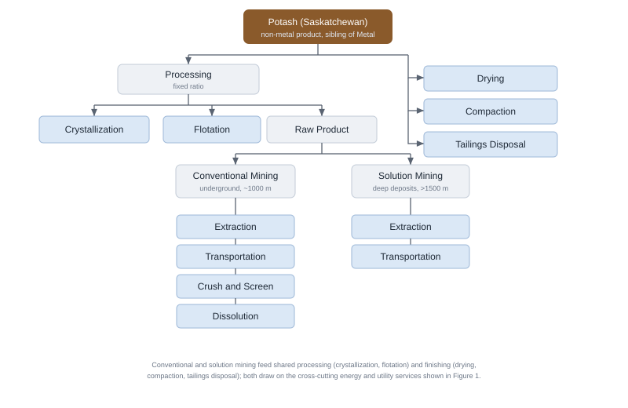

# Mining {#sec-mining}

The mining sector is represented in CIMS by an energy-service flow model. The emphasis is on the structure of that model — the hierarchy of nodes, the technologies that compete at each node, and the engineering ratios that link them — rather than on the geology or economics of individual mines. The model tree is region-agnostic: a single master structure is instantiated for every province and territory, and regional differences are expressed through which branches carry production and through the data attached to each node, not through separate per-region structures.

## Scope

CIMS represents both metal mining and non-metal mining. Metal mining is split into open-pit and underground operations, and within open-pit into iron and non-iron ores. Non-metal mining is dominated, in energy terms, by potash, which is modelled in full; other non-metal commodities are lower-energy but are within the scope of the sector and are noted below where they are not yet built out. The driving variable for the sub-model is the physical throughput of ore, expressed in tonnes; a forecast of ore throughput drives the demand for every downstream process and energy service, and is set exogenously in the same way as the output of the other industrial branches.

Several activities that are colloquially called "mining" are deliberately handled elsewhere in CIMS to avoid double-counting energy and emissions:

- Coal mining is covered in the [Coal Mining](sector_coal_mining.qmd) chapter and the energy-supply component.
- Oil and gas extraction and oil sands mining are covered under [Petroleum Crude](sector_petroleum_crude.qmd).
- Cement, lime, glass, brick, and other non-metallic *mineral products* are covered under [Industrial Minerals](sector_industrial_minerals.qmd) — these are downstream manufacturing branches, distinct from the extraction of the non-metal ores treated here.

The smelting and refining of mined concentrates is likewise excluded and handled in the [Metal Smelting and Refining](sector_metal_smelting.qmd) chapter; the mining sub-model stops at the mine gate, with a saleable concentrate or product as its final output.

## Real-world context

Canada is one of the world's leading mining nations, and the industry is highly regionalised. Metal mines produce base and precious metals — copper, nickel, zinc, gold, iron ore, and others — from both open-pit and underground operations. Saskatchewan is the world's largest potash-producing region, accounting on the order of 30% of global potash production [@nrcan-potash], and also supplies roughly a quarter of the world's uranium from the high-grade deposits of the Athabasca Basin [@wna-uranium]. The Northwest Territories host Canada's diamond industry, and Nunavut has growing gold and iron-ore production. Mining is capital-intensive and strongly export-oriented, so activity levels are driven by world commodity prices and ore grades rather than by domestic demand — which is why CIMS drives the sector with an exogenous throughput forecast rather than an endogenous demand response.

Mining is energy-intensive, and the energy is concentrated in a few activities. Comminution — the crushing, grinding, and milling that reduce run-of-mine rock to particles fine enough for mineral separation — is typically the single largest energy consumer at a metal mine; published estimates put it at roughly a quarter of final energy at an average mine site and a majority of mine *electricity* use [@ceec-comminution]. Diesel dominates mobile equipment, particularly haulage, and is the largest single fuel at many sites; many remote northern mines are off-grid and rely heavily on diesel generation for all loads. Ventilation is a large and distinctively underground electricity load, since deep mines must move enormous volumes of air for air quality and temperature control. The CIMS structure is built around exactly these distinctions: it separates open-pit from underground mining, breaks the ore-processing chain into its comminution stages, and represents ventilation, fans, pumping, and the other utility loads through the shared machine-drive service (see the [Industrial Machine Drive Systems](machine_drive.qmd) chapter).

## Model structure

Following the standard CIMS pattern, the sector divides into two sub-trees: a **Product** sub-tree, which is the physical production chain that turns ore into a saleable product, and a **Service** sub-tree, which holds the auxiliary energy and utility services that the production technologies draw on. @fig-mining-flow-model shows the overall structure.

As described in the [Sector Overview](sector_overview.qmd), each node carries a competition rule. **Fixed-ratio** nodes impose the unavoidable engineering sequence of process steps, while **tech-compete** nodes host competitions among alternative technologies on the basis of lifecycle cost (see @sec-technology-competition). In the mining tree, the disaggregation of products and process stages is built from fixed-ratio nodes, and the technology choices — which extraction method, which crusher, which boiler, which class of motor — occur at the tech-compete leaves.

{#fig-mining-flow-model .lightbox width=100%}

### Products: metal mining

Metal mining divides first into Open Pit and Underground, reflecting the substantial difference in their energy profiles (most importantly the ventilation load that underground operations carry). Open-pit mining is then split into an Iron path and a Non-Iron path, because iron ore and base/precious-metal ores follow different processing routes:

- The Iron path runs ore through a Raw Product stage (Extraction and Transportation), Primary and Secondary Crushing, and an Agglomeration stage that binds fine iron concentrate into a form suitable for downstream ironmaking.
- The Non-Iron path runs ore through Raw Product (Extraction, Transportation), Primary and Secondary Crushing, and Primary Milling (fine grinding), but no agglomeration.

Both open-pit paths feed a set of shared stages — Mineral Separation, Cleaning (concentrate drying), Tailing Disposal, and an Unassigned Energy node. Underground mining carries the same processing chain (grouped under a Processing node: Raw Product, Primary and Secondary Crushing, Primary Milling) together with its own Mineral Separation, Cleaning, Tailing Disposal, and Unassigned Energy nodes.

The Unassigned Energy node is a reconciliation device: it carries metered sector energy that has not yet been allocated to a specific process stage, so that the modelled total matches reported energy use while the more detailed allocation is still being developed.

<mark>TODO: Progressively reassign the Unassigned Energy at each mine type to specific process stages and technologies, and reduce it toward zero as the bottom-up representation improves.</mark>

### Products: non-metal mining

Non-metal mining is represented in the same Product sub-tree as a sibling of Metal. The dominant non-metal commodity by energy use is potash, whose structure is shown in @fig-mining-potash-sk. Potash production is met from two distinct mining methods that have markedly different energy profiles, and the model represents both:

- Conventional mining — underground extraction (at depths around 1,000 m), with its own Extraction, Transportation, Crush-and-Screen, and Dissolution stages.
- Solution mining — used for deeper deposits (beyond roughly 1,500 m), where the ore is dissolved in situ and pumped to surface, with a simpler Extraction and Transportation chain.

Both methods feed a shared surface-processing and finishing train — Crystallization and Flotation (under Processing), followed by Drying, Compaction, and Tailings Disposal — and, like the metal mines, both draw on the cross-cutting energy and utility services.

{#fig-mining-potash-sk .lightbox width=90%}

Canada's other non-metal mining is smaller in energy terms but is within the scope of this sector and is included here for completeness. The most significant omissions are uranium and diamonds, both of which are material parts of the Canadian mining industry even though their energy intensity is lower than that of metal milling.

<mark>TODO: Add uranium mining (Saskatchewan, Athabasca Basin — e.g. McArthur River and Cigar Lake). Saskatchewan supplies roughly a quarter of world uranium; it is currently absent from the sector.</mark>

<mark>TODO: Add diamond mining (Northwest Territories) and other northern non-metal mining, once the corresponding regional data are in place.</mark>

<mark>TODO: Confirm whether lower-energy non-metal extraction such as salt, gypsum, and aggregates should be represented explicitly or remain aggregated, given their small share of mining energy.</mark>

### Auxiliary energy and utility services

Mining's production technologies draw on the shared **Service** sub-tree rather than specifying their own utility equipment. These services are common to the industrial sectors and are documented in their own chapters in the General Services part; their general structure — and the "existing versus more efficient equipment, with fuel-switching where relevant" convention they follow — is set out in the [Sector Overview](sector_overview.qmd). This chapter does not repeat that detail. The services the mining sector draws on are:

- **Machine Drive** — see the [Industrial Machine Drive Systems](machine_drive.qmd) chapter. Mining's largest electrical loads sit here: comminution under Materials Processing, mine ventilation under Fans, and haulage and conveyance under Materials Handling, alongside Pumps and Compressed Air.
- **Steam** — see [Low-Temperature Industrial Heat](low_temp_industrial_heat.qmd), which covers boiler-raised steam and its fuel options.
- **Cogeneration** — see [Cogeneration](cogeneration.qmd) for combined heat-and-power.
- **Methane Blend** — the gaseous-fuel supply node, where natural gas competes with biogas, biomass gasification, and hydrogen.
- **HVAC** (space heating and cooling) and **Lighting** for mine facilities.

<mark>TODO: The current regional input files still implement an earlier, more detailed auxiliary structure (per-horsepower machine-drive classes; separate pumping, compression, ventilation, and conveyance sub-trees) and predate the Product/Service split. Migrate these files to the region-agnostic master tree and the shared General Services chapters referenced above.</mark>

## Decarbonisation technologies

Mining's emissions are dominated by diesel in mobile equipment and by the electricity and combustion that drive comminution, process heat, and ventilation. The main decarbonisation levers therefore sit at the Extraction and Transportation nodes (mobile equipment), the comminution stages (Crushing, Milling), Cleaning (concentrate drying), and underground ventilation, alongside the shared services documented in the General Services chapters. The technologies below are admitted to the relevant tech-compete nodes; representative performance and maturity are summarised in @tbl-mining-decarb. The figures quoted are indicative ranges from industry and techno-economic reviews [@bisulandu-mining-2026], not the calibrated values used in the model.

| Technology | Indicative benefit | Maturity |
|:-----|:--------|:----|
| Trolley-assist diesel-electric haulage | 40–60% energy saving on loaded climbs; ~28–36% CO₂ cut on a low-carbon grid | Commercial |
| Battery-electric haul truck | Eliminates tailpipe diesel; range / charging constrained | Early commercial |
| Hydrogen fuel-cell haul truck | Zero tailpipe emissions; H₂ supply constrained | Demonstration |
| Biodiesel / renewable diesel | Drop-in lifecycle CO₂ reduction, no new equipment | Commercial |
| High-pressure grinding rolls (HPGR) | ~20–30% lower downstream grinding energy | Commercial |
| Vertical / stirred mills | ~40% energy saving vs ball mills; integral drying | Commercial |
| Ore sorting / pre-concentration | Rejects barren rock; lowers energy per unit metal | Commercial (deposit-specific) |
| Ventilation on demand (VOD) | Up to ~50% ventilation energy saving | Commercial |
| Electric / heat-pump drying and boilers | Displaces gas- and oil-fired process heat | See Low-Temp Heat |
| High-efficiency motors + variable-speed drives | Lower auxiliary drive energy | See Machine Drive |

: Indicative performance and maturity of key mining decarbonisation technologies {#tbl-mining-decarb}

### Mobile equipment and haulage

Diesel haulage is the largest single diesel load at most surface mines. Trolley-assist systems feed the truck's electric drive from an overhead catenary on the energy-intensive loaded uphill segments, cutting energy use on those segments by roughly 40–60% and lifecycle CO₂ by about 28–36% where the connected grid is low-carbon; the technology is commercial and deployed at several open-pit operations [@bisulandu-mining-2026]. Battery-electric haul trucks, now offered by the major equipment makers, remove tailpipe diesel entirely but are constrained by range and charging time and remain early-commercial; hydrogen fuel-cell haul trucks are at the demonstration stage. Biodiesel and renewable diesel are drop-in fuels that cut lifecycle CO₂ without new equipment and are already represented in the tree (the "Extraction Biodiesel" and "Biodiesel truck" technologies). In CIMS these options compete at the Extraction and Transportation nodes.

### Comminution efficiency

Comminution is the single largest electricity consumer at a metal mine, so efficiency gains here have an outsized effect. High-pressure grinding rolls (HPGR) pre-fracture ore between counter-rotating rolls and reduce downstream grinding energy by about 20–30%. Vertical roller and stirred mills can deliver on the order of 40% energy savings relative to conventional ball mills and combine grinding with drying in a single unit. Ore sorting and pre-concentration reject barren rock before milling, lowering the energy spent per unit of contained metal, though their applicability is deposit-specific [@bisulandu-mining-2026]. These compete at the Crushing and Milling nodes, while ore sorting acts as a service-side reduction in the feed sent to milling.

### Electrified and low-carbon process heat

Concentrate drying (Cleaning) and process steam are met largely by combustion today. The low- and zero-emission alternatives — electric and heat-pump drying, electrode and electric-resistance boilers, biomass and hydrogen boilers, and mechanical vapour recompression — are described in the [Low-Temperature Industrial Heat](low_temp_industrial_heat.qmd) chapter and reached through the **Steam** service; the **Methane Blend** node additionally substitutes biogas, biomass gas, and hydrogen for natural gas in any remaining gas-fired duty.

### Ventilation and auxiliary drive (underground)

Ventilation can account for roughly 40–50% of an underground mine's energy use. Ventilation on demand (VOD) matches airflow to where vehicles and crews are actually working and can cut ventilation energy by up to about 50% [@abb-vod]; high-efficiency fans and motors with variable-speed drives further reduce auxiliary drive energy. These are represented through the Fans and other machine-drive end uses described in the [Industrial Machine Drive Systems](machine_drive.qmd) chapter.

### Potash-specific options

Conventional potash mining already relies on electric continuous miners and electric hoisting, so its decarbonisation depends mainly on grid emissions intensity and on electrifying surface haulage; VOD applies in the underground workings. Solution mining and the surface Drying and Compaction stages are heat-intensive and decarbonise through the same low-carbon heat options as above — in particular mechanical vapour recompression for crystallization and evaporation duties, and electric or biomass boilers for drying.

### Indicative capital and operating costs and energy use

@tbl-mining-technoecon gathers order-of-magnitude capital and operating costs and energy characteristics for the main comminution and mobile-equipment technologies. The estimates are drawn from public techno-economic literature [@ceec-comminution; @bisulandu-mining-2026; @srk-haultruck] and expressed in 2025 Canadian dollars: US-dollar sources were converted at the mid-2025 rate of roughly 1.37 CAD/USD and adjusted to 2025 where the source year differed. Because mining capital is dominated by site-specific concentrators and mobile fleets, the figures are given per piece of equipment or relative to a baseline rather than per tonne of capacity where that is more meaningful; energy intensity is per tonne of ore. Fixed O&M follows the heavy-industry convention of roughly 4–6% of capital cost per year. The values are for relative comparison only, not project budgeting, and are separate from the plant-specific values the model carries internally.

| Technology | Overnight capex (2025 CAD) | Fixed O&M | Energy intensity | Main energy carrier |
|:-----|:-----|:-----|:-----|:-----|
| SAG / ball-mill comminution | site-specific concentrator capital | ~4–6%/yr | ~20–60 kWh/t ore (≈0.07–0.2 GJ/t) | electricity |
| High-pressure grinding rolls (HPGR) | ≈ SAG circuit (±~10 M per circuit) | ~4%/yr | ~10–35% less than SAG | electricity |
| Vertical / stirred mills | moderate | ~4%/yr | ~40% less than ball mills | electricity |
| Diesel haul truck (≈150–290 t) | ~2–3.4 M per truck | high fuel cost | diesel | diesel |
| Battery-electric haul truck | ~4–7 M per truck (+100–150%) | ~65% lower cost per t moved | electricity | electricity |
| Hydrogen fuel-cell haul truck | higher than battery-electric (demonstration) | — | hydrogen | hydrogen |
| Trolley-assist (diesel-electric) | overhead catenary infrastructure | — | 40–60% energy saving on loaded climbs | grid electricity |
| Ventilation on demand (VOD) | retrofit controls (low) | — | up to ~50% ventilation energy saving | electricity |

: Indicative techno-economic characteristics of mining technologies, 2025 CAD {#tbl-mining-technoecon}

<mark>TODO: Replace the indicative literature ranges above with the capital costs, efficiencies, availability years, and emission factors actually used at these nodes in the model input files.</mark>

## Economics

Technology choice at every tech-compete node follows the lifecycle-cost competition of @sec-technology-competition. Each technology carries a capital cost, fixed operating and maintenance cost, an output (node-unit) basis, a service request for the energy or upstream service it consumes, and availability and lifetime years; these are annualised, combined with service costs into a lifecycle cost, and converted to market shares by the inverse-power choice rule.

A few sector-wide conventions are worth noting. Mining technologies are discounted at a high rate (35% in the current data). These values are **behavioural** (revealed or empirical) discount rates, not true financial costs of capital: they sit well above the single-digit rates a firm's cost of capital would imply because they summarise the short payback horizons, risk aversion, and other non-financial barriers that govern real technology-adoption decisions, and CIMS applies this behavioural rate throughout the lifecycle-cost calculation (see the discount-rate discussion in the [Theory](theory.qmd) chapter and @sec-technology-competition). **Heterogeneity (variance) parameters** at the process nodes are set so that competitions respond to cost differences without collapsing to winner-take-all. Fuel prices entering the service-cost calculation are scaled by a sector-level block of price multipliers, allowing the mining sector to face prices that differ from the generic delivered price of each fuel.

Greenhouse-gas costs enter through the fuels: combustion emissions follow from each technology's fuel service requests and the prevailing carbon price, so fuel-switching — from diesel haulage to biodiesel or electric, or from natural gas to hydrogen or biogas in the methane blend — is the model's main channel for emissions reduction.

<mark>TODO: Mining has no carbon-capture (CCS) service in the current tree (see the [Carbon Capture, Utilization, and Storage](ccus.qmd) chapter), on the assumption that its emissions are predominantly combustion-related and dispersed. Confirm this is appropriate, and add process-emissions representation if any mined commodity warrants it.</mark>

## Regional coverage and differences

Because the tree is region-agnostic, every province and territory is built from the same master structure, and a region simply carries no production on the branches that do not apply to it. Regional differences therefore show up in *where* production sits rather than in the shape of the tree:

- Potash production is concentrated in Saskatchewan, which carries essentially all of the potash branch.
- Iron ore is concentrated in the Atlantic region (the Labrador Trough, on the Québec–Newfoundland border) and Québec, which carry most of the open-pit iron path.
- Base- and precious-metal mining is spread across British Columbia, Ontario, Manitoba, Québec, and the Atlantic region (for example nickel in Manitoba and Ontario, and copper and gold in British Columbia), populating the non-iron and underground branches.
- Territorial mining — diamonds in the Northwest Territories and gold and iron ore in Nunavut — populates the metal and (future) non-metal branches in those regions.

<mark>TODO: Several regions are not yet populated in the current input files. Build out mining throughput and technology data for Alberta and the three territories (the territories are not yet represented anywhere in CIMS — see the Architecture chapter), so that the region-agnostic tree is exercised everywhere it should be.</mark>

<mark>TODO: The Atlantic, Manitoba, Ontario, and Québec metal mines are currently represented generically rather than by commodity. Consider whether the Iron / Non-Iron split, plus any commodity-specific energy intensities, adequately capture the real mix in each region, and refine where the averaging is too coarse.</mark>

## Limitations and planned extensions

The mining sub-model is a deliberately simplified representation. The TODOs above record the main gaps between this design and both the current input files and the real Canadian mining sector: the auxiliary-service migration to the MECS structure; the reassignment of Unassigned Energy; the addition of uranium, diamonds, and the smaller non-metal commodities; full provincial and territorial coverage including Alberta and the territories; and the question of commodity-level detail within metal mining. Together these define the path from the current state of the model to the region-agnostic, fully populated design described in this chapter.

<mark>TODO: Replace the illustrative real-world figures and the example discount-rate value in this chapter with quantitative values drawn directly from the model input files, and add a benchmark of modelled mining energy use against CIEEDAC / Natural Resources Canada data.</mark>



```{=latex}
\phantomsection
```

## References {.unnumbered}

```{=latex}
\printbibliography[heading=none]
```

::: {#refs}
:::
