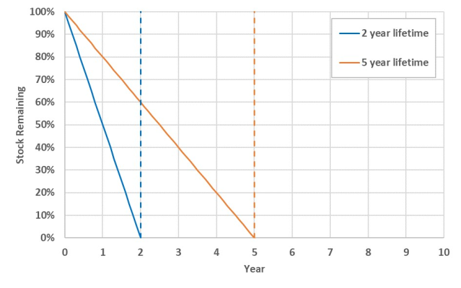
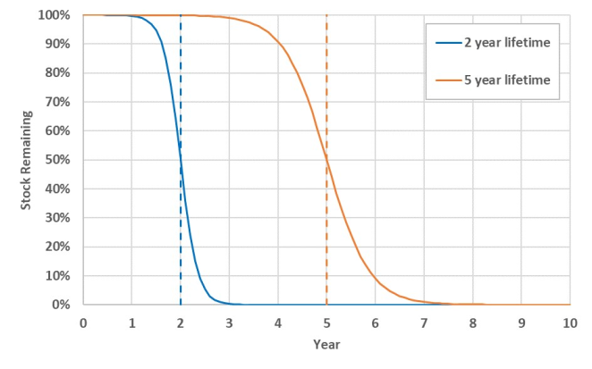
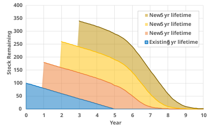

# Technology Competition {#sec-technology-competition}

Sub-model technology choice occurs according to the following order:

- Demand Assessment
- Retirement
- Assessment of capital stock availability
- Retrofit & new capital stock competition to meet demand not supplied by existing capital stock

## Demand Assessment

All of the CIMS energy demand models (industry, transportation, commercial / institutional and residential) start with an exogenously determined demand for physical goods and services in each run period. These demands are mostly taken from Natural Resources Canada forecasts. The energy supply models may either use exogenously determined forecasts or they can be run using energy demand calculated from the demand model plus net exports.

### Request-Provide demand

### Distributed supply

## Capital Stock Retirement

CIMS begins each simulation with an existing base stock of technologies. @eq-stock_retirement_existing describes how the existing stock of unknown age already in use is retired. Each year a constant amount of the base stock is retired until there is no more base stock remaining (@fig-stock_retirement_existing).

$$
{BS}_{t} = {BS}_{0}\left( 1 - \frac{T_{t} - T_{0}}{L} \right)
$$ {#eq-stock_retirement_existing}

::: {.eq-vars}
$BS_t$
:   base stock at time $t$

$BS_0$
:   initial base stock

$T_t$
:   current simulated year

$T_0$
:   initial year

$L$
:   lifespan of the technology
:::

{#fig-stock_retirement_existing .lightbox width=80%}


Retirement of capital stock purchased during a CIMS simulation is calculated using a different methodology since the vintage of new stock is known and an explicit lifetime (and retirement schedule) can be applied to the stock purchase.

$$
{NS}_{t} = \frac{{NS}_{p}}{1 + e^{\frac{11.513}{L}\left( \left( T_{t} - T_{p} \right) - L \right)}}
$$ {#eq-stock_retirement_new}

::: {.eq-vars}
$NS_t$
:   new stock not yet retired at time t

$NS_p$
:   new stock acquired at purchase time p

$T_t$
:   current simulated year

$T_p$
:   year at purchase time p

$L$
:   lifespan of the technology

$11.513$
:   intercept value from ISTUM model for average technology retirement rates
:::

This function uses an s-shaped, logistic curve to simulate the retirement of technologies. @fig-stock_retirement_new shows examples of the retirement function for technologies with different lifespans. Half of the stock is retired before the average lifespan of the technology due to early replacement and failure and half is retired afterward to simulate technologies that last longer than the average. The default intercept value of 11.513, which comes from market research on product failure rates, is used in CIMS for many technologies that are purchased and installed. For other longer-lived technologies, like building shells, lower intercepts are used that flatten the logistic curve.

{#fig-stock_retirement_new .lightbox width=80%}

The total stock of a technology in any given year *t* is the sum of the unretired base stock and the unretired new stock remaining from each previous year (@eq-stock_total).

$$
{Stock}_{t} = {BS}_{t} + \sum_{p = 0}^{t}{NS}_{t}
$$ {#eq-stock_total}

{#fig-stock_total .lightbox width=80%}

## Retrofit and New Stock Competition

While retrofitting occurs before new stock competition, the retrofitting equations are a subset of the new stock equations and are therefore presented after them. The market shares for individual technologies are determined using the equations below.

### New Stock Competition

@eq-market_share_new is a normalized inverse-power function: the market share of each technology is proportional to its lifecycle cost raised to $-v$, divided by the sum of that quantity over all competitors. It is the multinomial choice analogue of softmax, but with a power-law transform of cost instead of an exponential[^tech-choice-family] — which means lifecycle-cost *ratios*, rather than differences, drive the share split. The variance parameter $v$ controls how sharply the competition responds to those ratios: a high value, such as $v = 30$, makes the lowest-cost technology capture almost all new equipment stocks (approaching the winner-take-all rule of a linear program), while a low value, such as $v = 1$, spreads new equipment shares almost evenly across competing technologies even when their lifecycle costs differ significantly. Equivalently, in log-cost space the equation has the form of a multinomial logit on $\ln LCC$.

[^tech-choice-family]: The CIMS choice rule belongs to the family of log-linear utility, multiplicative-error discrete choice models sometimes called the **Weibit** model. Standard multinomial logit [@mcfadden] assumes a Gumbel-distributed additive error term in utility and yields choice probabilities of the form $e^{V_k} / \sum_j e^{V_j}$; the Weibit instead assumes a Weibull-distributed multiplicative error and yields the power-form expression used here [@castillo-weibit]. The distinction occasionally matters when calibrating $v$ against empirical data, because the implied stochastic interpretation of the lifecycle cost differs. For background on how the logit-style framework is used in CIMS more broadly, see @rivers-jaccard.

$$
{MS}_{k} = \frac{{LCC}_{k}^{- v}}{\sum_{j = 1}^{J}{LCC}_{j}^{- v}}
$$ {#eq-market_share_new}

::: {.eq-vars}
$MS_k$
:   market share of technology *k* for new equipment stocks

$LCC_k$
:   annual lifecycle cost of technology *k*

$v$
:   variance parameter representing cost homogeneity
:::


$$
{LCC}_{kt} = {CC}_{kt} + {OM}_{k} + {SC}_{kt}
$$ {#eq-lifecycle_cost}

::: {.eq-vars}
$LCC_{kt}$
:   annual lifecycle cost of technology *k* at time *t*

$CC_{kt}$
:   capital cost of technology *k* at time *t*

$OM_k$
:   operating costs of technology *k*

$SC_{kt}$
:   service cost of technology *k* at time *t*
:::

Note somewhere that technology capital costs should be included as CAPEX where possible to ensure apples-to-apples comparison across the competition.
$$
{CC}_{t} = \max\left\{ {DCC}_{t},\, {CC}_{2000} \cdot {DCC}_{limit} \right\}
$$ {#eq-capital_cost_annual}

::: {.eq-vars}
$CC_t$
:   annual capital cost of a technology at time *t*

$DCC_t$
:   declining capital cost at time *t*

$CC_{2000}$
:   capital cost of a technology in the year 2000 (before applying the declining capital cost function)

$DCC_{limit}$
:   lowest value to which a technology's capital cost can be reduced by the DCC function (as a percentage of the capital cost in year 2000)
:::

See the section below for the declining capital cost functions.

$$
{CC}_{2000} = \left( \frac{{CC}_{overnight} + FIC + {DIC}_{t}}{Output} \right) \cdot CRF
$$ {#eq-capital_cost_2000}

::: {.eq-vars}
$CC_{2000}$
:   capital cost of a technology in the year 2000 (before applying the declining capital cost function)

$CC_{overnight}$
:   overnight capital cost

$FIC$
:   upfront fixed intangible cost, representing non-financial costs of investment

$DIC_t$
:   upfront intangible cost that can decline over time

$Output$
:   material output of a technology

$CRF$
:   capital recovery factor
:::

$$
CRF = \frac{r}{1 - {(1 + r)}^{- N}}
$$ {#eq-capital_recovery_factor}

::: {.eq-vars}
$CRF$
:   capital recovery factor of a technology

$r$
:   financial discount rate

$N$
:   lifespan of the technology
:::

$$
{SC}_{kt} = \sum_{j} P_{jt} \cdot R_{kjt}
$$ {#eq-service_cost}

::: {.eq-vars}
$SC_{kt}$
:   service cost of technology *k* at time *t*

$P_{jt}$
:   price of service type *j* at time *t* (can be either an energy price or the weighted-average lifecycle cost of a service, based on the market shares of technologies competing to provide that service)

$R_{kjt}$
:   amount of service type *j* requested by technology *k* at time *t*
:::

Note that market shares used to calculate the weighted-average LCC of a service are from the previous iteration of the demand-supply equilibrium process (i.e. the final market shares from the previous year if calculating the first iteration or the previous demand-supply iteration if equilibrium prices have not yet been found).

<mark>**Subsidies**</mark>

### Retrofit

The retrofit option allows functioning equipment to be converted to a different type of equipment before its retirement date. For example, a boiler could be retrofitted into a cogenerator before it's lifetime-based retirement. After existing stock is retired, CIMS treats the initial purchasing price of the incumbent technology as a sunk cost and uses the operating and maintenance (O&M), energy, service and emissions costs as the only costs of the incumbent technology. The costs of the retrofit options are then calculated as the sum of O&M, energy, service and emissions costs plus the annualized retrofit capital cost less any tax or other credit. CIMS then determines, using a similar competition calculation to those already described, how many incumbent technologies will be retrofitted.

The analyst can place some bounds on this retrofit option. A maximum (R-MAX) or minimum (R-MIN) market share can be established such that only a certain amount of the old stock could (maximum) or must (minimum) be retrofitted in any year. In an unconstrained market, maximum should be set to 1 and minimum to 0.

## Modifications to the technology choice equations

Several functions have been added to the competition process to reflect both real world conditions and policy concerns. These currently include functions to:

- Reduce capital costs as total production increases to reflect learning by doing and efficiencies of scale;

- Reduce intangible costs as new market share climbs to reflect reduced perceived risk (i.e. the neighbour effect); and

- Eliminate obsolete but still functioning technologies.

### Declining Capital Cost

The declining capital cost function allows the capital costs of technologies to decline as a result of learning by doing and improving economies of scale. In CIMS, capital costs decline as a result of the cumulative production of a technology across Canada and an exogenous rate of decline which represents production in other countries.

<mark>**Need to align this description and function below with Thomas' update of DCC function**</mark>

$$
{DCC}_{t} = {GCC}_{t} \cdot \left[ \left( \sum_{1}^{p} \frac{{CumulNS}_{2000,p} + \sum_{j = 2005}^{t - 5}{NS}_{jp}}{{CumulNS}_{2000,p}} \right)^{\log_{2}(PR)} \right]
$$ {#eq-declining_capital_cost}

::: {.eq-vars}
$DCC_t$
:   declining capital cost of a technology at time *t*

$GCC_t$
:   capital cost of a technology adjusted for cumulative stock in other countries

$NS_{jp}$
:   new stock of a technology added from 2005 to the previous time period in each province *p*

$CumulNS_{2000,p}$
:   cumulative new stock of a technology for all years up to and including the year 2000 in each province *p* (exogenous)

$PR$
:   progress ratio
:::

Increased stock in other countries reduces the capital costs of a technology in CIMS. Therefore, even if there is no change in stock of a technology in Canada, its capital costs may still decline. The rate at which the capital costs decline as a result of global stock change is set exogenously.[^aeei]

[^aeei]: This is equivalent to the autonomous energy efficiency index (AEEI).

$$
{GCC}_{t} = {GCC}_{t - 5} \cdot (1 - AEEI)^{5}
$$ {#eq-global_capital_cost}

::: {.eq-vars}
$GCC_t$
:   capital cost of a technology after it has been adjusted for cumulative stock in other countries

$AEEI$
:   exogenous rate of decline of a technology's capital costs
:::

In order to prevent capital costs from declining indefinitely, an analyst may specify the percentage of the initial capital costs below which capital costs may not decline.

Research has shown that investment in one technology (e.g., hybrid cars) can lower costs of another technology (e.g., battery cars). This can be achieved by setting technologies to the same DCC category so that the sum of all installed stock for technologies within that category is used when determining capital costs.

### Declining Intangible Cost Function

The declining intangible cost function allows non-financial costs to fall as a result of reduced perceived risk as market exposure increases. The following general formula applies.

$$
\text{(Equation 20 — placeholder for the declining intangible cost function)}
$$ {#eq-declining_intangible_cost}

::: {.eq-vars}
$I_t$
:   intangible cost in time *t*

$I_0$
:   initial intangible cost (column N of the economic file for capital, column R for operating costs)

$A$
:   constant in column O of the economic file for capital, column S for operating costs

$K$
:   constant in column P of the economic file for capital, column T for operating costs

$NMS$
:   new market share

$NMS_{t-5}$
:   new market share from the previous run, expressed between 0 and 1 (i.e. between 0% and 100%, not 0 and 100). $NMS$ is the technology's share among all other technologies that provide the same service.
:::

### Forward looking behaviour

The foresight functions simulate business and consumer behaviour for considering future costs. The functions calculate the expected emissions cost of technologies, considering different lifespans and discount rates.

CIMS has three options for generating expectations: 1) myopic, where people do not have foresight into their future emissions costs; 2) foresight based on the average emissions costs of a technology; and 3) foresight based on the discounted value of emissions costs of a technology.

**Myopic**

The emissions charge used to calculate the lifecycle cost of technology is the current tax rate.

$$
E(\text{EmissionsCharge})_{kt} = \text{EmissionsCharge}_t
$$ {#eq-emissions_myopic}

**Average Expectations**

The second option generates expectations of future emissions costs based on the average emissions charge over the lifespan of a technology.

$$
\text{(Equation 22 — placeholder for the average-expectations function)}
$$ {#eq-emissions_average}

::: {.eq-vars}
$\text{EmissionsCharge}_n$
:   emissions charge in year *n*, set in CIMS's Simulation Creation Centre

$base$
:   year in which technology *k* is purchased

$N$
:   lifespan of technology *k*
:::

**Discounted Expectations**

The third option generates expectations of future emissions costs based on the present value of emissions charges. After the present value of emissions charges has been calculated, it is annualized using the capital recovery factor.

$$
\text{(Equation 23 — placeholder for the discounted-expectations function)}
$$ {#eq-emissions_discounted}

::: {.eq-vars}
$\text{EmissionsCharge}_n$
:   emissions charge in year *n*, set in CIMS's Simulation Creation Centre

$base$
:   year in which technology *k* is purchased

$N$
:   lifespan of technology *k*

$r_k$
:   revealed discount rate of technology *k*, set in the Techno Economic file
:::



```{=latex}
\phantomsection
```

## References {.unnumbered}

```{=latex}
\printbibliography[heading=none]
```

::: {#refs}
:::
